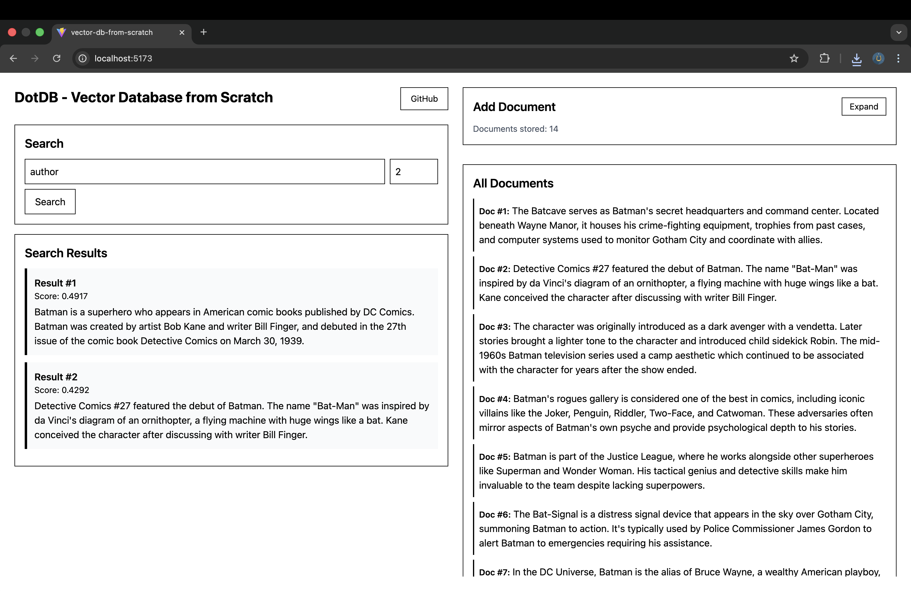

# DotDB - Vector Database from Scratch

A fully in-browser vector database implementation with semantic search capabilities. [Here's the vector DB in 300 lines of code](./src/dotdb/index.ts)



## Features

- **Pure Browser Implementation** - No backend required, runs entirely in your browser
- **Persistent Storage** - Uses IndexedDB to store vectors across sessions
- **Embeddings** - Powered by HuggingFace Transformers.js ([bge-small-en-v1.5)](https://huggingface.co/Xenova/bge-small-en-v1.5))
- **Cosine Similarity** - Fast vector similarity search with configurable top-K results
- **Auto-chunking** - Automatically splits documents by paragraphs for better search granularity

## Tech Stack

- **TypeScript**
- **IndexedDB** - Browser-native persistent storage of vectors & metadata
- **React & Tailwind** - For UI
- **Transformers.js** - Client-side embeddings generation
- **Vite** - Fast development & build

## Getting Started

```bash
# Install dependencies
pnpm install

# Run development server
pnpm dev

# Build for production
pnpm build
```

## How It Works

1. **Add Documents** - Paste text, it's automatically split into paragraphs and embedded
2. **Search** - Query using natural language
3. **Get Results** - Ranked by cosine similarity with configurable top-K

All embeddings are generated client-side and stored in IndexedDB for instant recall.

## Live Demo

Soon
